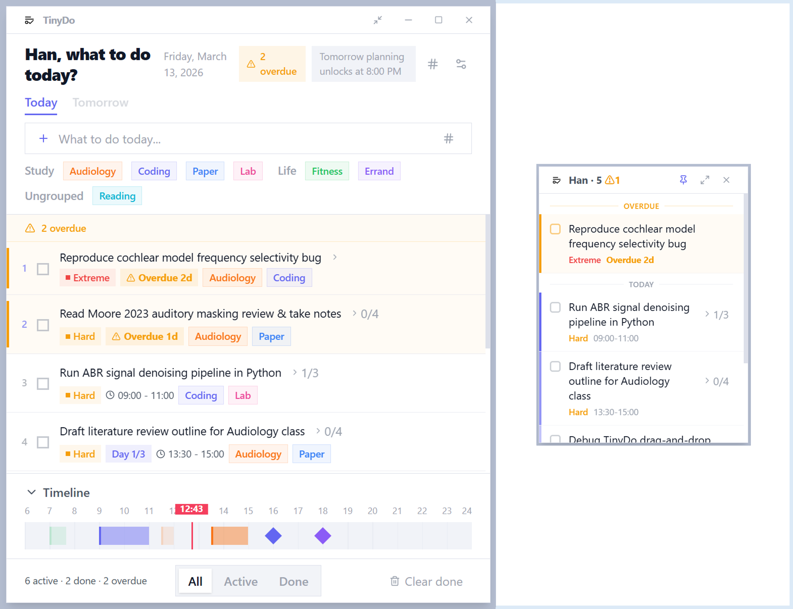

<p align="center">
  
</p>

<h1 align="center">TinyDo</h1>

<p align="center">
  A lightweight, elegant desktop to-do app built with Tauri v2 + React + TypeScript.
</p>

<p align="center">
  
  
  
  
  
  
</p>

<p align="center">
  <a href="README.zh-CN.md">简体中文</a>
</p>

<p align="center">
  
</p>

## Download

Grab the latest installer from the [**Releases**](https://github.com/Hanziwww/tinydo/releases) page — no build tools required.

## What's New in v2.0

- **SQLite persistence** — Data is now stored in a local SQLite database instead of localStorage, removing the ~5 MB size limit and improving reliability. Existing v1 data is automatically migrated on first launch.
- **Rust-powered reminders** — Reminder scheduling moved from JS polling (every 15 s) to precise `tokio` timers in Rust, working reliably even when the window is minimized.
- **Rust-side file I/O** — Export, import, and poster saving now run entirely in Rust for better performance and security. The CRC32/pHYs PNG logic has been moved out of JS.
- **Global shortcut** — Press `Ctrl+Shift+T` anywhere to toggle the TinyDo window.
- **Launch at startup** — Optional auto-start on system login, configurable in Settings.
- **Security hardening** — Content Security Policy enabled, frontend filesystem permissions removed (all I/O goes through Rust invoke commands).
- **Structured error handling** — Unified `AppError` type with `thiserror`, plus file-based logging via `tauri-plugin-log`.

## Getting Started

> If you prefer to build from source:

### Prerequisites

- [Node.js](https://nodejs.org/) >= 18
- [Rust](https://www.rust-lang.org/tools/install) (stable toolchain)
- [Tauri v2 prerequisites](https://v2.tauri.app/start/prerequisites/)

### Install & Run

```bash
# Clone the repository
git clone https://github.com/Hanziwww/tinydo.git
cd tinydo

# Install frontend dependencies
npm install

# Run in development mode
npm run tauri dev

# Build for production
npm run tauri build
```

The installer will be generated in `src-tauri/target/release/bundle/nsis/`.

## Architecture

```
tinydo/
├── public/                     # Static assets (icons, poster)
├── src/                        # Frontend (React + TypeScript)
│   ├── components/             # React UI components
│   ├── hooks/                  # Custom React hooks
│   ├── i18n/                   # Internationalization (zh / en)
│   ├── lib/
│   │   ├── backend.ts          # Typed invoke() wrappers for all Rust commands
│   │   ├── init.ts             # App init & localStorage-to-SQLite migration
│   │   ├── export.ts           # Export/import orchestration (dialog + invoke)
│   │   ├── poster.ts           # Poster rendering (html-to-image + invoke)
│   │   └── utils.ts            # Date/time helpers
│   ├── stores/                 # Zustand state stores (in-memory, backed by SQLite)
│   ├── types/                  # TypeScript type definitions
│   ├── App.tsx                 # Root component with backend hydration
│   └── main.tsx                # Entry point
├── src-tauri/                  # Backend (Rust)
│   ├── src/
│   │   ├── main.rs             # Entry point
│   │   ├── lib.rs              # App setup, plugins, tray, global shortcut
│   │   ├── models.rs           # Serde data models (mirrors TS types)
│   │   ├── error.rs            # AppError enum (thiserror)
│   │   ├── db.rs               # SQLite schema, connection, CRUD operations
│   │   ├── reminders.rs        # Tokio-based reminder scheduler
│   │   └── commands/           # Tauri invoke command handlers
│   │       ├── todos.rs        # Todo CRUD commands
│   │       ├── tags.rs         # Tag & tag group commands
│   │       ├── settings.rs     # Settings & legacy migration commands
│   │       └── export.rs       # Export/import/poster file I/O
│   ├── capabilities/           # Tauri permission definitions
│   └── Cargo.toml              # Rust dependencies
├── package.json
└── README.md
```

## License

[MIT](LICENSE)
